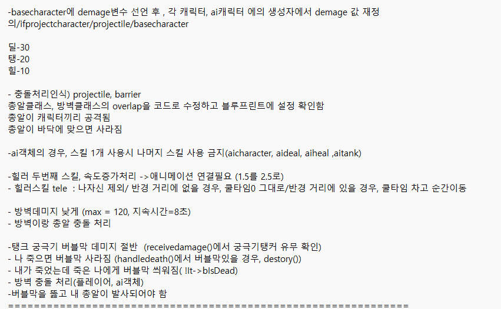
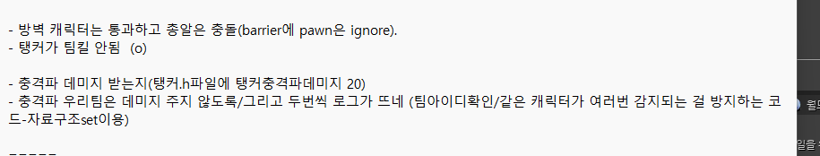
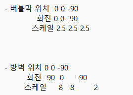
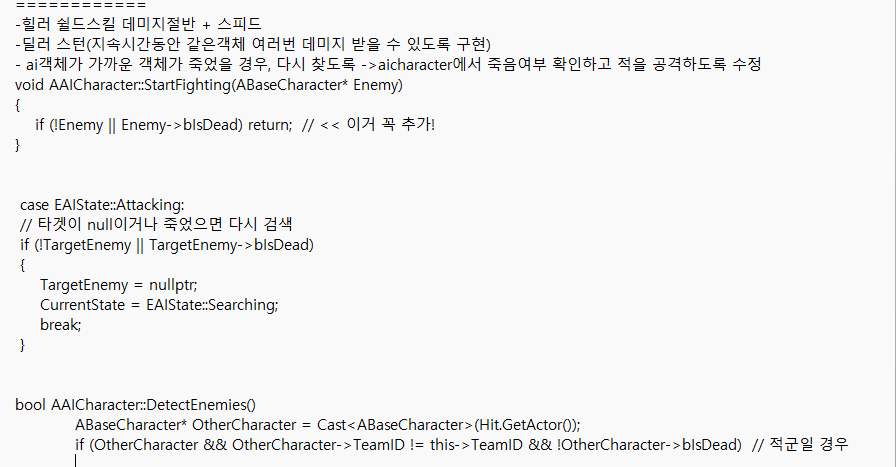

# UnderGround
C++ 미니프로젝트 - 3 vs 3 하이퍼 FPS 점령전 - Ifproject

프로젝트 진행상황 기록


## 프로젝트 1일차(3/26)

1. 프로젝트계획서 작성

2. 언리얼런처 다운로드 https://www.unrealengine.com/ko/download

    - 계정생성
    - 4.27 버전 다운로드 및 카드 등록

3. 언리얼 c++ 개발 연동
 
    1. 언리얼 엔진과 Visual Studio 연결:
        - Visual Studio는 언리얼 엔진에서 C++ 코드를 작성하고, 컴파일하는 툴입니다.

        - 언리얼에서 C++ 프로젝트를 만들면 자동으로 Visual Studio 프로젝트 파일을 생성하고, 코드 작성은 Visual Studio에서 합니다.

        - 언리얼 엔진은 코드를 실행하고, 게임 테스트를 진행하는 환경을 제공합니다.

    2. 헤더 파일(.h)과 소스 파일(.cpp)의 역할:
        - 헤더 파일(.h): 주로 클래스 선언, 함수 프로토타입, 변수 선언, 언리얼 엔진 관련 매크로(예: UCLASS, UPROPERTY, UFUNCTION) 등을 포함합니다. 이 파일은 클래스의 인터페이스를 정의합니다.

        - 소스 파일(.cpp): 헤더 파일에서 선언한 함수들의 구현을 포함합니다. 실제 동작과 로직이 구현됩니다.

    3. 헤더 파일의 주요 구성:
        - 클래스 선언: 클래스 이름, 상속 관계, 공개(public) 메서드와 변수들을 정의.

        - 언리얼 매크로: UCLASS(), UPROPERTY(), UFUNCTION() 등을 사용하여 언리얼 엔진의 특정 기능을 활성화합니다.

        - 예: UCLASS()는 클래스가 게임 객체로 인식되게 하고, GENERATED_BODY()는 엔진이 자동으로 필요한 코드 생성.

    4. 소스 파일의 주요 구성:
        - 함수 구현: BeginPlay(), Tick() 등과 같은 함수들의 동작을 정의합니다.

        - 객체 초기화: 예를 들어, 생성자에서 기본적인 변수 값을 설정하거나 초기화합니다.

        - 게임 로직 구현: 객체가 어떻게 움직이거나 동작할지를 정의합니다.

    5. 언리얼 엔진의 클래스와 객체:
        - 클래스 선언에 UCLASS() 매크로를 사용하여 언리얼 엔진의 객체 관리 및 에디터 통합을 활성화합니다.

         - **GENERATED_BODY()**는 언리얼 엔진이 필요한 코드를 자동으로 생성하도록 돕습니다.

        - 객체별로 각기 다른 헤더 파일과 소스 파일을 만들고, 각각 독립적으로 관리됩니다.

    6. 객체가 2개일 경우:
        - 두 객체는 각각 독립적인 헤더 파일과 소스 파일을 가집니다.

        - 두 객체는 자신만의 UCLASS와 관련 코드를 갖고, 서로 다른 동작을 할 수 있습니다.

        - 헤더 파일에서는 UCLASS()와 같은 매크로를 사용하여 언리얼 엔진과 연동하는 코드가 포함되고, 소스 파일에서는 객체의 구체적인 구현(예: Tick(), BeginPlay() 등)이 이루어집니다.

4. 언리얼 기초 실습

5. 언리얼 시작하기
    - 언리얼 아이콘 클릭
    - visual studio에서 f5
        - 솔루션-속성-공용속성-한개의 시작프로젝트-언리얼프로젝트명 클릭
        - 솔루션-속성-구성속성-언리얼프로젝트명 development_editor x64 빌드 체크
        - 메뉴탭에서 development_editor x64 후 f5로 실행 , 종료할 경우 디버깅 종료


## 프로젝트 2일차(3/27)
- 1인칭 시점 컨텐츠 브라우저
    1. 블루프린터
        - 1인칭 캐릭터의 움직임, 점프, 카메라 등을 제어하는 로직을 담고 있을 것입니다.
       
    2. Maps
        - Maps는 게임에서 플레이어가 탐험할 수 있는 레벨(맵) 파일입니다.
        -  여러 개의 맵을 만들어서 게임의 각 레벨을 설정할 수 있습니다.
    3. FirstPerson Overview
        -  1인칭 시점에 대한 개요나 설명, 또는 1인칭 모드와 관련된 정보를 다루는 블루프린트나 설정일 수 있습니다. 
        - 시점의 전환이나 카메라 설정을 다루는 내용일 가능성이 큽니다.
- 블루프린터
    1. 액터 블루프린트 (Actor Blueprint)
        - 게임 내의 객체나 배경 등을 제어하는 데 사용됩니다. 예를 들어, 게임 오브젝트, 적, 무기, 캐릭터 등 다양한 액터를 만들 수 있습니다.
        - 액터 블루프린트는 특정한 동작이나 속성을 가진 오브젝트를 정의하고 제어하는 데 사용됩니다.

    2. 클래스 블루프린트 (Class Blueprint)
        - 클래스 블루프린트는 언리얼 엔진에서 기본적인 블루프린트 유형을 의미합니다. 기본적으로 액터나 다른 객체를 만들 때 사용하는 "클래스"입니다.
        - 액터, 컴포넌트, UI 등 다양한 객체들의 행동을 정의하는 블루프린트입니다.

        - 특정 액터나 캐릭터의 특성이나 행동을 정의할 때 사용합니다.

    3. 인터페이스 블루프린트 (Blueprint Interface)
        - 서로 다른 블루프린터 간의 통신을 가능하게 하는 인터페이스
    4. 애니메이션 블루프린트 (Animation Blueprint)
        - 캐릭터의 애니메이션을 제어하는 데 사용됩니다. 
        - 예를 들어, 캐릭터가 걷고 뛰는 등의 상태에 따라 애니메이션을 전환하는 로직을 작성할 수 있습니다.
    5. 위젯 블루프린트 (Widget Blueprint)
        - UI(사용자 인터페이스)를 제어하는 데 사용됩니다. 
        - 버튼, 텍스트 박스, 슬라이더 등 다양한 UI 요소를 배치하고, 이들 간의 상호작용을 설정할 수 있습니다.
  

- 블루프린터 이벤트 그래프


- visual studio에서 언리얼 실행 -대시 실습 및 블루프린트 확인
    1. 언리얼에서 새 c++클래스 생성
    2. character상속받은 Mycharacter생성
    3. 빌드, f5실행하여 언리얼 창 열어서 Mycharacter클래스의 Blueprint 생성
    4. 프로젝트세팅에서 Mycharacter을 default pawn class로 선택 및 input에서 키와 함수명   
    5. 애니메이션

- 애니메이션 블루프린트 
    - 사용하는 Skeleton(보통 캐릭터의 스켈레톤을 선택)을 선택
    1. 이벤트그래프(게임 로직)
        - 속도(Speed)나 점프 상태 등을 변수로 설정하여 상태 전환의 기준으로 사용할 수 있습니다.
    2. 애니메이션 그래프(애니메이션과 관련된 상태 머신)
        - New State Machine 추가
        - 추가된 상태 머신을 더블 클릭하여 State Machine Editor로 이동
    3. New State Machine 
        - 우클릭하여 Add State
        - 상태들 사이에 마우스를 올려놓으면, Transition을 추가할 수 있는 화살표가 나타납니다.
    - 애니메이션 블루프린트와 캐릭터 연결
        - Character Blueprint를 열고, Skeletal Mesh Component를 선택합니다.
        - Anim Class 항목에 방금 만든 애니메이션 블루프린트를 할당합니다.
        - 캐릭터가 애니메이션 블루프린트를 사용할 수 있도록 설정하는 과정입니다.

## 프로젝트 3일차(3/28)

- 일인칭 슈팅 C++ 튜토리얼 (https://dev.epicgames.com/documentation/ko-kr/unreal-engine/first-person-shooter-tutorial-in-unreal-engine)
    - 프로젝트 구성
         1. 새 프로젝트 구성
            - 게임(Games) 프로젝트 카테고리를 선택합니다.
            - 기본(Blank) 템플릿을 선택합니다.
            - 블루프린트(Blueprint) 가 아닌 C++ 프로젝트 타입을 선택합니다.
            - 시작용 콘텐츠(Starter Content) 를 비활성화합니다.
         2. 에디터 시작 맵 설정
            - 콘텐츠 브라우저 로 이동하여 콘텐츠 폴더에 Maps 폴더를 생성
            - 메인 메뉴 패널에서 파일(File) 을 클릭하고 현재 레벨을 다른 이름으로 저장(Save Current Level as...) 을 선택
            - 현재 레벨을 다른 이름으로 저장 창에서 Maps 폴더를 선택하고 새 맵의 이름을 FPSMap 으로 지정한 후 저장(Save) 을 클릭
            - 프로젝트 세팅
         3. Visual Studio에서 프로젝트 열기
            - 메인 메뉴 패널에서 툴(Tools) 을 클릭하고 Visual Studio 열기(Open Visual Studio) 를 선택하여 Visual Studio에서 C++ 코드를 엽니다.
         4. 프로젝트에 로그 메시지 추가
         5. 첫 번째 C++ 클래스 컴파일
         6. C++ 게임 모드 클래스를 블루프린트로 확장하기
            - 콘텐츠 폴더 안에 Blueprints 폴더를 생성합니다.
            - 새 블루프린트 클래스의 이름을 BP_FPSProjectGameModeBase 로 지정하고 Blueprints 폴더를 선택한 후 블루프린트 클래스 생성(Create Blueprint Class)버튼을 클릭합니다.
            - 블루프린트 에디터 를 닫기 전에 BP_FPSProjectGameModeBase 블루프린트를 저장하세요.
            - **블루프린트 검은화면일 경우, 창-레이아웃불러오기-풀 블루프린트 에디터 열기**
            - 프로젝트 세팅 맵 & 모드(Maps & Modes) 를 클릭합니다. 기본 게임모드(Default GameMode)
    - 캐릭터 구현

        1. 새 캐릭터 제작 및 C++ FPS 캐릭터 클래스를 블루프린트로 확장하기
            - 메인 메뉴 패널에서 툴(Tools) 을 클릭하고 새 C++ 클래스...(New C++ Class...) 를 선택합니다.
            - 캐릭터(Character) 를 부모 클래스로 선택하고 다음(Next) 을 클릭합니다.
            - FPSCharacter 기반 블루프린트 클래스 생성(Create Blueprint class based on FPSCharacter) 을 클릭하여 블루프린트 클래스 추가(Add Blueprint Class) 대화 메뉴를 엽니다.
            - 블루프린트 에디터 를 닫기 전에 BP_FPSCharacter 블루프린트를 저장 하세요.
            - 프로젝트 세팅 탭- 맵 & 모드(Maps & Modes)-선택된 게임 모드(Selected GameMode) 섹션을 펼치고 디폴트 폰 클래스(Default Pawn Class) 드롭다운 메뉴에서 BP_FPSCharacter 를 선택합니다.

        2. 축 매핑 구성
            - 프로젝트 세팅 -입력(Input) - 축 매핑/액션 매핑

        3. 캐릭터 무브먼트 함수 구현
            - FPSCharacter.h
            - FPSCharacter.cpp
            - VS에서 FPSCharacter 헤더 .h 와 .cpp 구현 파일을 저장합니다.
            - 솔루션 탐색기 로 이동하여 FPSProject 를 선택합니다.
            - FPSProject 를 우클릭하고 빌드 를 선택하여 프로젝트를 컴파일합니다.

        4. 마우스 카메라 컨트롤 구현
            - 프로젝트 세팅 -입력(Input) - 축 매핑/액션 매핑
            - FPSCharacter.cpp
            - VS에서 FPSCharacter 헤더 .h 와 .cpp 구현 파일을 저장합니다.
            - 솔루션 탐색기 로 이동하여 FPSProject 를 선택합니다.
            - FPSProject 를 우클릭하고 빌드 를 선택하여 프로젝트를 컴파일합니다.

        5. 캐릭터 점프 구현
            - 프로젝트 세팅 -입력(Input) - 축 매핑/액션 매핑
            - FPSCharacter.h
            - FPSCharacter.cpp
            - VS에서 FPSCharacter 헤더 .h 와 .cpp 구현 파일을 저장합니다.
            - 솔루션 탐색기 로 이동하여 FPSProject 를 선택합니다.
            - FPSProject 를 우클릭하고 빌드 를 선택하여 프로젝트를 컴파일합니다.

        6. 캐릭터에 메시 추가 
            1. 메시 에셋 추가
                - 콘텐츠 브라우저 의 파일 창 내부를 우클릭하여 에셋 임포트 대화창을 엽니다.
                - '/Game...에 임포트(Import to /Game...)' 를 클릭하여 임포트(Import) 대화창을 엽니다.
                - .fbx 메시 파일을 찾아 선택합니다.
                - 열기(Open) 를 클릭하여 프로젝트에 메시 임포트를 시작합니다.
                - 콘텐츠 브라우저 에 FBX 임포트 옵션 대화창이 나타납니다. 모두 임포트(Import All) 를 클릭하여 프로젝트에 메시를 추가합니다.

            2. 삼인칭 메시 구성하기
                - 콘텐츠 > Blueprints 에서 BP_FPSCharacter 블루프린트 클래스 아이콘을 더블 클릭하여 블루프린트 에디터 에서 엽니다.
                - 컴포넌트(Components) 탭에서 메시(Mesh) 컴포넌트를 클릭합니다.
                - 디테일 패널로 이동하여 메시 로 스크롤합니다(화면 우측 또는 창(Window) > 디테일(Details) 에 있음).
                - 스켈레탈 메시(Skeletal Mesh) 아래 드롭다운 창을 열고 GenericMale 스켈레탈 메시를 선택합니다.
                - 블루프린트 에디터 에서 뷰포트(Viewport) 를 클릭하여 스켈레탈 메시를 미리 봅니다.
                - 스켈레탈 메시가 CapsuleComponent 내부에 있는지, 메시가 ArrowComponent 와 같은 방향을 향하고 있는지 검증합니다. 스켈레탈 메시 컴포넌트의 방향을 제대로 조정해야 캐릭터가 월드에서 올바르게 이동하도록 할 수 있습니다.
                - 블루프린트 에디터 를 닫기 전에 BP_FPSCharacter 블루프린트를 컴파일 하고 저장 하세요
                - 레벨 에디터 툴바에서 플레이 버튼을 클릭합니다. 캐릭터를 움직이면 캐릭터의 섀도를 볼 수 있습니다.
        7. 카메라 뷰 변경
            - FPSCharacter.h
            - FPSCharacter.cpp
            - VS에서 FPSCharacter 헤더 .h 와 .cpp 구현 파일을 저장합니다.
            - 솔루션 탐색기 로 이동하여 FPSProject 를 선택합니다.
            - FPSProject 를 우클릭하고 빌드 를 선택하여 프로젝트를 컴파일합니다.
            - 레벨 에디터 툴바 에서 플레이 버튼을 클릭합니다. 이제 카메라가 캐릭터 머리보다 살짝 위에 있을 것입니다.
            - 콘텐츠 브라우저 에서 BP_FPSCharacter 를 열고 뷰포트 로 이동하는 경우 캐릭터가 다음과 같이 보입니다.
        8. 캐릭터에 일인칭 메시 추가
            - FPSCharacter.h
            - FPSCharacter.cpp
            - VS에서 FPSCharacter 헤더 .h 와 .cpp 구현 파일을 저장합니다.
            - 솔루션 탐색기 로 이동하여 FPSProject 를 선택합니다.
            - FPSProject 를 우클릭하고 빌드 를 선택하여 프로젝트를 컴파일합니다.
            - 이 시점에서 캐릭터 메시는 에디터 내부에서 보이지 않아야 합니다.
        9. 메시 블루프린트 빌드하기
            - 콘텐츠 > Blueprints 에서 BP_FPSCharacter 블루프린트 클래스 아이콘을 더블 클릭하여 블루프린트 에디터 에서 엽니다.
            - 컴포넌트(Components) 탭에서 메시(Mesh) 컴포넌트를 클릭합니다.
            - 디테일 패널로 이동하여 메시 로 스크롤합니다(화면 우측 또는 창(Window) > 디테일(Details) 에 있음).
            - 스켈레탈 메시(Skeletal Mesh) 아래 드롭다운 창을 열고 FBX 임포트 옵션(FBX Import Options) 대화창에서 지우기(Clear) 를 선택한 후 모두 임포트(Import All) 를 클릭합니다.
            - 메시지 로그 창을 닫습니다.
            - save all
            - BP_FPSCharacter 아이콘을 더블 클릭하여 블루프린트 에디터-mesh말고 fpsmesh
            - 디테일 패널로 이동하여 메시 섹션으로 스크롤한 후 스켈레탈 메시 아래 드롭다운을 클릭합니다. 드롭다운 메뉴에서 HeroFPP 스켈레탈 메시를 선택하여 뷰포트 에 팔을 추가합니다.
       

    - 발사체 구현  
    
    - 캐릭터 애니메이션

- 스킬 구현
    1. 대쉬-  1초동안 이동속도빠르게

        - 언리얼에서 블루프린트 생성
        - 키 input 설정 (Sprint/왼쪽 shift키)
        - default pawn class  설정 및 부모클래스(FPSCharacter)의 동작 실행 확인

        - 미구현-대시함수 구현에 필요없는 작업이었음
            - ABP_TankerCharacter_Dash 블루프린트에서 IDLE, Sprint에 애니메이션 에셋브라우저 연결 필요
            - 에셋브라우저에 에셋없음 ->에셋 다운로드 , 프리뷰메시, 리타겟 필요

## 주말 추가 학습 3/29
- 1인칭시점 BaseFPSCharacter 구현
    - 좌우이동, 점프, 카메라, 발사 , 조준(o)
    - **추가작업**
        - 조준 위치 및 조준이미지(매시)
        - 점프, 발사 등의 동작 시 애니메이션

- 딜러의 대시함수 구현
    - 기본기능(점프, 좌우, 카메라) (O)+ 대시함수(O) 
    - **대쉬 추가작업**
        - 대시 지속시간, 속도 조절해서 거리이동 필요 , 지금은 이동거리 너무 짧음
        - 대시 중 무적 (SetActorEnableCollision(false) → 다시 true)
        - 대시 이펙트 (파티클 생성)
        - 대시 애니메이션 재생 (PlayAnimMontage)
- 탱커의 방벽함수 구현
     

    - 기본기능(점프, 좌우, 카메라)
    - 방벽함수 (barrieractor,  tankercharacter, fpsPlaystate , projectile 헤더파일, c++파일)
    - 방벽기능 로직 추가
        - 방벽이 적군만 충돌하고 아군은 통과하는 로직 
        - 방벽이 공격받는 방식 (총알 → 방벽 데미지 처리)  
        - 머티리얼 설정 예시
    - 컴파일 완료
    - 언리얼설정(디폴트객체, 탱커블루프린트(barrierclass, projectile class), 방벽블루프린트(material, mesh))
    - 실행확인
        - 방벽 데미지(현재는 아군도 데미지 주게 됨)
        - 방벽 키 누르면 방벽 나옴
        - 방벽이 normal에서 cracked로 바뀜

    - **방벽 추가작업**
        - 방벽 이미지 fbx파일로 메시만들어서 BarrierActor의 블루프린트의 static mesh 수정해야함
        - 데미지 다양화
        - 총알이 통과하면서 이펙트
        - 방벽이 살짝 반응(예: 반짝임) 하는 식
        - 총알이 장애물을 공격하면 장애물이 흔들리는 것

## 프로젝트 4일차(3/31)

    
- 탱커 방벽 기술 마무리
    1.  방벽 투명도
        - Base_Material을 만들고 Blend Mode를 Translucent로 설정함.
    2. 방벽 방향 및 크기
        - barrier_actor 블루프린트에서 mesh-트랜스폼 조절
        - 스케일 x=2.0 , y= 1.0, z= 2.0
        - 회전 x = -90.0 , y = 0.0 , x= -90.0 
    3. 방벽이 공격받는 방식 (아군일때는 데미지 없고 적군일때는 데미지 있게) 
       
- 팀 선정
    - gamemode.h, gamemode.cpp, 각 캐릭터.cpp
   
    - **팀선택 추가사항**
        - 게임 시작 전에 UI에서 팀을 수동으로 선택
        - 게임 시작 전에 랜덤으로 팀배정될 경우, 3:3이 될 수 있도록 팀의 분배 필요
        - 팀 색깔 설정
        - 캐릭터에서 팀 확인


- 힐러의 스킬 구현
    - 아군 위치를 파악 → 해당 아군 근처로 이동 → 일정 시간 동안 강화된 광역 힐을 제공
    1. 아군 중 가까운 대상 찾기 - AFPSCharacter* AHealerCharacter::FindClosestAlly()
        - 팀 ID 기반 필터링 + 위치 정보 활용
    2. 해당 위치로 이동 (Simple Move) - void AHealerCharacter::ActivateHealSkill()
        - FPSCharacter의 자식클래스 Tankercharacter, Dealercharacter을 찾기 위해서는 UGameplayStatics::GetAllActorsOfClass() 대신 TActorIterator 템플릿을 쓰면 자식 클래스까지 다 포함해서 탐색 가능해!
        ```C++
        //HealerCharacter.cpp
        #include "EngineUtils.h"  // TActorIterator 쓸 때 필요
        ```
    3. 1번, 2번 과정 실행
        - ai로 확인위해 AIController, AICharacter클래스 및 블루프린트 필요 (AI는 기본적으로 PlayerState가 없음 → 직접 만들어줘야 함)
        - FPSCharacter.h에 CustomPlayerState 구조 추가
        - HealerCharacter의 FindClosestAlly() - 월드 내 모든 캐릭터 중 자신과 같은 팀이고 거리상 가장 가까운 캐릭터를 탐색
        - HealerCharacter의 ActivateHealSkill() - Q 키 눌렀을 때 실행 /FindClosestAlly()로 가장 가까운 아군 찾기 / 찾았다면 이동 목표 좌표 저장 & 이동 시작
        - HealerCharacter의  Tick 함수에서 이동 처리
        - 힐러 이동이 안 된 이유 — PlayerState가 null이어서 아군 탐색이 안 되는 문제
            - FindClosestAlly()로 아군을 잘 찾았고 ActivateHealSkill()에서 아군 위치를 가져와 이동하도록 했는데 Q를 눌러도 힐러가 움직이지 않았음
            
## 프로젝트 5일차(4/1)
- 탱커 방벽 에너지 처음값 고려(궁극기 70데미지, 기본 20데미지 받으니깐 어느정도 높아야 할 듯)
     - 게임 구조 다시 정리해보자
        - 딜러/힐러/탱커의 일반 공격: 1초에 1발, 20 데미지
        - 궁극기 공격: 1회 70 데미지
        - 방벽 지속시간: 5초
        - 공격자 수: 최대 3명 (3vs3 구조)

    - 방벽 MaxHealth는 200~250 사이가 가장 적절해 보여.
        - 일반 공격 2명 이상이 집중하면 부술 수 있음
        - 궁극기 + 일반 공격 조합으로도 부술 수 있음
        - 힐러 혼자 있으면 방벽이 효율 있게 보호해줌

- 힐러의 스킬 구현
    4. 도착하면 아군의 힐 증가 30  & 쿨타임 10초 진행시간 5초
        1. 아군적군 공격-healer, tanker, dealer
        2. 힐러 스킬
        3. 실행확인(ai팀은 aicontroller에서 setTeamId()/캐릭터팀은 캐릭터의 begin()함수내에서  setTeamId())
        - 힐러, 딜러, 탱커 최대 목숨 정의(FPSCharacter기본 목숨100으로 설정) +  총 발사시, 기본데미지 20감소
        - 같은 팀 공격 시 데미지 감소 하지 않고, 다른 팀 공격 시 데미지 감소
        - 힐러의 경우, 같은 팀 공격시, 데미지 증가하여 목숨 연장

- **힐러의 스킬 추가사항**
    1. `해당 위치로 이동 시, 반경 근처까지 이동`
        - 현재 맵이 작기에 80f로 근접한 상태임
        - 나중에 거리 바꿔야함
  
    2. 한번씩 되었다가 안되었다가 하는 문제 (해결완료)
        - 원인 : 광역힐동안 상대에게 총을 쏴야함
        - 해결 : 자동으로 증가되도록으로 수정
        ```C++
        //HealCharacter.h
        private:
            AFPSCharacter* TargetAlly = nullptr;

        //HealCharacter.cpp
        void AHealerCharacter::Tick(float DeltaTime)
        {
        Super::Tick(DeltaTime);
        GEngine->AddOnScreenDebugMessage(-1, 0.f, FColor::Green, TEXT("Tick..."));
        if (bIsMovingToTarget)
        {
            GEngine->AddOnScreenDebugMessage(-1, 0.f, FColor::Green, TEXT("HealerCharacter MOVING..."));
            FVector Direction = (TargetMoveLocation - GetActorLocation()).GetSafeNormal();
            AddMovementInput(Direction, 1.0f);

            // 도착 판정
            float Distance = FVector::Dist(GetActorLocation(), TargetMoveLocation);
            GEngine->AddOnScreenDebugMessage(-1, 1.f, FColor::Purple,
                FString::Printf(TEXT("거리: %.2f"), Distance));
            if (Distance < 80.f)
            {
                bIsMovingToTarget = false;

                GEngine->AddOnScreenDebugMessage(-1, 2.f, FColor::Cyan, TEXT("Arrive my team memeber"));
                

                // 힐 발동 (여기서 총 쏘는 로직 제거하고 바로 힐 적용)
                if (TargetAlly) // 직전에 저장해둔 대상
                {
                    TargetAlly->ReceiveHealing(20);  // 기본 힐량 20 (수정 가능)
                    GEngine->AddOnScreenDebugMessage(-1, 2.f, FColor::Green, TEXT("AUTO HEAL COMPLETE!"));
                }


                bHealingBoostActive = true;

                GEngine->AddOnScreenDebugMessage(-1, 2.f, FColor::Green, TEXT("heal skill ACTIVIVE"));

                // 일정 시간 후 힐 강화 종료
                GetWorld()->GetTimerManager().SetTimer(HealBoostTimerHandle, [this]()
                    {
                        bHealingBoostActive = false;
                        GEngine->AddOnScreenDebugMessage(-1, 2.f, FColor::Silver, TEXT("heal skill END"));
                    }, 5.f, false); // 5초간 유지
            }
        }
        }
        ```
        ```c++
        //FPSCharacter.h
        public:
        //힐러 광역힐 자동 힐 주입 위한 함수
            void ReceiveHealing(int32 Amount);

        //FPSCharacter.cpp
        void AFPSCharacter::ReceiveHealing(int32 Amount)
        {
            Health = FMath::Clamp(Health + static_cast<float>(Amount), 0.f, MaxHealth);

            GEngine->AddOnScreenDebugMessage(-1, 1.5f, FColor::Blue,
                FString::Printf(TEXT("%s 힐 받음: %d / %d"), *GetName(), Health, MaxHealth));
        }
        ```
- 탱커 궁극기 (모든 아군에게 일정 수치 보호막 부여)
    - 궁극기 발동 시 10초 동안 주변 아군에게 보호막부여(UI) + 받은 데미지 50% 감소
    1. BaseCharacter에 방어 관련 변수 추가
      
    2. ATankerCharacter에 궁극기 함수 만들기
      
    3. 입력키 바인딩
    - 언리얼에서 프로젝트세팅에서 키 설정 (UseUltimate / R)

    4. 실행확인
    - 탱커가 궁극기 썼을 때 AI객체가 총을 쏠 때, 데미지 변화
        - 궁극기 10초 지속시간 동안은 데미지 절반만큼 입음
        - 궁극기 지속시간 끝난 후에는 다시 원래 데미지만큼 입음

    - 탱커가 궁극기 썼을 때 AI객체가 총을 쏠 때, 같은 팀 딜러와 힐러의 데미지 변화 
        - 아군 모두 버블막 형성되어  10초 지속시간 동안은 데미지 절반만큼 입음
        - 탱커, 딜러, 힐러 팀ID=0 -> 딜러,힐러는 AICONTROLLER로 , 탱커는 조작하는 것으로
        - AI객체(NOBarrierAttackAICharacter) 팀ID=0 -> 같은 팀 공격안함
        - AI객체(NOBarrierAttackAICharacter) 팀ID=1-> 상대 팀 공격함
    - ai객체
        - NOBarrierAttackAICharacter - 3초마다 총 쏨
        - AttackAICharacter - 방벽이 인지될 경우에 총 쏨
        
    5. 궁극기 썼을 때, 버블같은 UI생성
        - 머터리얼 만들기
      
        - 머터리얼을 버블actor블루프린트에 적용하기

        - 탱커블루프린트에 버블 actor 연결하기
      
## 프로젝트 6일차(4/2)
- 탱커, 딜러, 힐러 블루프린트에 VisualShieldActorClass에 BubbleVisualShieldActor 설정
    - 부모클래스 FPSCharacter.h
    ```c++
    UPROPERTY(EditDefaultsOnly, Category = "Skill")
    TSubclassOf<AActor> BubbleShieldVisualClass;

    ```
    - 자식클래스 블루프린트 VisualShieldActorClass에 BubbleVisualShieldActor
    - 실행확인
        - 탱커 궁극기 아군 버블막 - 딜러(o) 힐러(o)  데미지 (o)
        - 힐러 스킬 아군 버블막 -탱커 (o) 
        - 힐러 스킬 아군 버블막 -딜러 (o) 
       
- 힐러 스킬 구현
    - 지정 방어- 거리가 가장 먼 1명의 아군에게 3초간 방어막 부여 + 방어막 유지 동안 이동속도 증가.
    - 실행 - 버블막형성 시간(o) /버블막형성 위치(o)/속도증가(o)  / 쿨타임(o) 
    ```c++
    //healerCharacter.cpp 의 skill2함수 내 수정
   void AHealerCharacter::ActivateHealSkill2() {
    if (!bCanUseHealSkill2)
    {
        GEngine->AddOnScreenDebugMessage(-1, 2.f, FColor::Red, TEXT("HEAL SKILL2 IS COOLTIME"));
        return;
    }
    AFPSCharacter* FoundAlly = FindFurthestAlly();

    if (FoundAlly)
    {
            // 비주얼 방패 생성
            FVector SpawnLocation = FoundAlly->GetActorLocation() + FVector(0, 0, 0.f);   //z축을 0으로 설정하여 버블막 형성 위치 조절

            FRotator SpawnRotation = FRotator::ZeroRotator;

            AVisualShieldActor* ShieldVisual = GetWorld()->SpawnActor<AVisualShieldActor>(BubbleShieldVisualClass, SpawnLocation, SpawnRotation);

            if (ShieldVisual)
            {
                // 부모를 캐릭터로 붙이면 따라다님
                ShieldVisual->AttachToActor(FoundAlly, FAttachmentTransformRules::KeepWorldTransform);
            }

            GEngine->AddOnScreenDebugMessage(-1, 5.0f, FColor::Red, TEXT("healer's skill2 FIND CHARACTER"));
            // 팀 비교 (TeamID 같은지 체크)
            if (FoundAlly->GetTeamID() == this->TeamID)
            {
                GEngine->AddOnScreenDebugMessage(-1, 5.0f, FColor::Red, TEXT("healer's skill2 FIND MY TEAM"));
                FoundAlly->SetBUnderTankerUltimate(true);

                // 일정 시간 후 데미지 감소 해제
                FTimerHandle TimerHandle;
                GetWorldTimerManager().SetTimer(
                    TimerHandle,
                    [FoundAlly, ShieldVisual]()
                    {
                        FoundAlly->SetBUnderTankerUltimate(false);
                        GEngine->AddOnScreenDebugMessage(-1, 5.0f, FColor::Red, TEXT("healer's  skill2 END"));
                        if (IsValid(ShieldVisual))
                        {
                            ShieldVisual->Destroy(); // 버블막 형성 제거
                        }
                    },
                    UltimateDuration,
                    false
                );

                // 여기서 대상 속도 증가
                float BeforeSpeed = FoundAlly->GetCharacterMovement()->MaxWalkSpeed;
                FoundAlly->GetCharacterMovement()->MaxWalkSpeed *= HealSpeedBoostMultiplier;
                float AfterSpeed = FoundAlly->GetCharacterMovement()->MaxWalkSpeed;

                GEngine->AddOnScreenDebugMessage(-1, 2.0f, FColor::Yellow,
                                FString::Printf(TEXT("%s --------speed UP: %.1f -> %.1f"), *FoundAlly->GetName(), BeforeSpeed, AfterSpeed));

                // 일정 시간 후 데미지 감소 + 속도 복구 + 버블막 제거
                            
                GetWorldTimerManager().SetTimer(
                                TimerHandle,
                                [FoundAlly, ShieldVisual, BeforeSpeed]()
                                {
                                    FoundAlly->SetBUnderTankerUltimate(false);
                                    FoundAlly->GetCharacterMovement()->MaxWalkSpeed = BeforeSpeed;
                                    GEngine->AddOnScreenDebugMessage(-1, 2.0f, FColor::Silver,
                                        FString::Printf(TEXT("%s --------speed DOWN"), *FoundAlly->GetName()));

                                    if (IsValid(ShieldVisual))
                                    {
                                        ShieldVisual->Destroy();
                                    }
                                },
                                UltimateDuration,
                                false
                );
            }
    }
    else
    {
        UE_LOG(LogTemp, Warning, TEXT("NO TEAM MEMBER"));
    }
    }

    ```


- 쿨타임을 bool에서 float로 수정(딜러 대쉬/ 힐러 skill1, skill2/탱커 skill, 궁극기)

- 힐러 궁극기 구현
    - 궁극기 부활 -사망한 모든 아군 즉시 부활
    ```c++
    //FPSCharcter .h
    public:

    // 부활 함수
    UFUNCTION()
    virtual void Revive();

    // 사망 여부
    UPROPERTY(BlueprintReadOnly, Category = "Health")
    bool bIsDead = false;

    private:
    
    // 사망 처리 함수 (너가 이미 따로 쓰고 있다면 그 함수 안에 bIsDead = true; 추가해줘)
    void HandleDeath();
    ```

    
    - 언리얼 프로젝트 세팅 설정 -키보드 F 
    ```c++
     PlayerInputComponent->BindAction("HealUltimateSkill", IE_Pressed, this, &AHealerCharacter::ActivateResurrectUltimate);
    ```

- 스킬 통합 구현
- 스킬 통합 구현 코드 추가
    - BaseCharacter
    - TankerCharacter
## 프로젝트 7일차(4/3)
- 스킬 통합 구현
    - ai객체, 팀모드 병합 필요
    - 스킬명, 스킬 키 정리 필요 - 궁극기 키 동일할 때, 캐릭터모드를 판단하여 궁극기 실행
    - spawnpointActor 수정 필요
- 해야할 것
    - 힐러, ai힐러 코드 병합
    - 타이머 코드 정리

 ## 프로젝트 8일차(4/4)   
- 실행 확인
    - 기본 총, 데미지 
    - 궁극기 부활	-부활함수에 시각화 코드 추가	/ 죽는 함수 코드에 DESTORY()제거.	/basecharacter의 모든 함수에 bIsDead 조건문 추가
    - 스킬명, 스킬 키 정리 필요

## 프로젝트 추가 작업 (4/5~4/6)
- 부활함수, 힐러부활함수 별도의 함수 구현
- 스킬 1개 사용시 나머지 스킬 사용 금지
- 힐,탱,딜 총알 데미지 다르게 :-basecharacter에 demage변수 선언 후 , 각 캐릭터, ai캐릭터 에의 생성자에서 demage 값 재정의
- 힐러 스킬 1 tele 이동하도록    -basecharacter.tick/basecharcter에 변수3개 선언 / heal, aiheal 수정/힐스킬1,힐스킬2 수정/ navigation헤더호출/build.cs 추가 (o)
- 방벽이랑 총알 충돌 처리
- 방벽데미지 낮게




- 방벽 캐릭터는 통과하고 총알은 충돌

## 프로젝트 마무리(4/7)
- 힐러데미지 절반(basecharacter receive damage수정) 

- 캐릭터 정해지면 블루프린트(방벽, 버블막) ->캐릭터 지정되면 버블막, 방벽 키우기
- 버블막 , 방벽 위치


- ai와 캐릭터 스킬 원활하게 작동하는지 실행확인

=======================
- dash 왼쪽 shift
- stun  기절 E
- dealerultimate Q


- Barrier 왼쪽 shift   (방벽 세우기) 
- PerformShockStrikeSkill E
- BarrierUltimate Q  (모든 우리팀 버블막)

- HealSkill  Q    (가까운 아군 찾아 힐 증가)
- HealSkill2   E (먼 아군 찾아 3초 버블막 및 그 아군은 속도 증가)
- HealUltimateSkill Q (아군 1명 부활)

- 공통 총알장전 R
